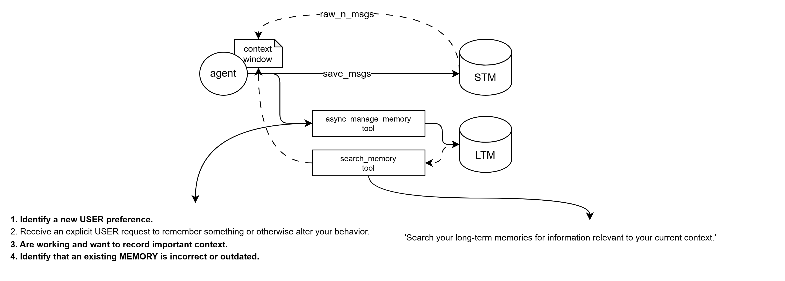

# Agent Harness

## Memory Management System

An implementation of a robust memory management strategy for AI agents using **LangGraph** and **LangMem**. This part of the agent harness focuses on providing agents with long-term persistence and semantic memory capabilities.

## Core Memory Strategy

This agent utilizes a multi-layered memory approach:

- **Semantic Memory:** Using `InMemoryStore` with vector embeddings (`all-MiniLM-L6-v2`) to store and retrieve relevant information across conversations.
- **Dynamic Context:** Tools for creating, updating, and searching long-term memories based on user interactions and explicit preferences.
- **User Profiling:** Persistent storage of user-specific details to personalize agent behavior.

## Session Management & Profiling (Current Focus)

### How to manage and organize storage for same-session memories?

To effectively organize memories within a single session while maintaining long-term relevance:

1.  **Namespace Isolation:** Utilize the `namespace` parameter in `InMemoryStore` to separate global user knowledge from session-specific context (e.g., `namespace=("user_id", "session_id", "temp_context")`).
2.  **Memory Consolidation:** Implement a background "distillation" process that summarizes chat history into core facts before storing them in long-term memory.
3.  **Profiling & Ranking:** Use metadata filters to rank memories by recency and relevance within the current session's semantic namespace.
4.  **Semantic Chunking:** Break down complex session data into atomic "memories" to avoid context window clutter and improve retrieval precision.
