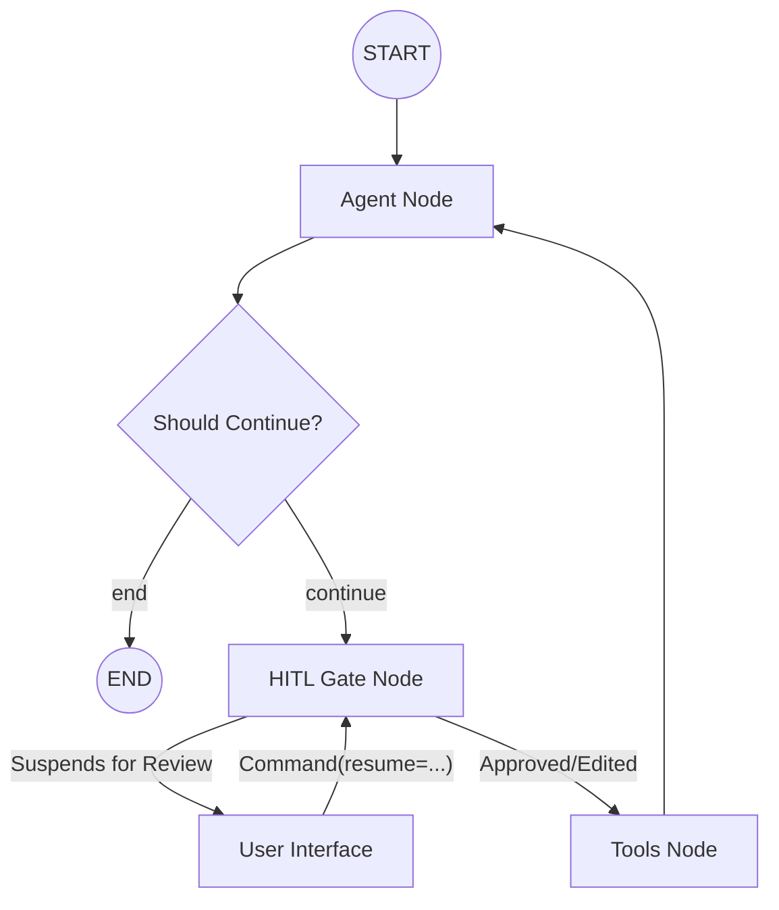

# Human-In-The-Loop (HITL) Implementation

## Overview

This document outlines the architectural approach and technical implementation of Human-In-The-Loop (HITL) within the Agent Harness. The implementation provides a bridge between autonomous agent decisions and human oversight, enabling a review process for sensitive tool executions.

## Architectural Approach

The HITL system is built following **SOLID principles** and the **Interceptor Pattern**. Instead of using black-box high-level abstractions, I have implemented a custom, low-level gate node that mimics the behavior of LangChain's `HumanInTheLoopMiddleware` while remaining fully integrated into our custom graph strategy.

### Key Principles Applied:

- **Single Responsibility (SRP)**: The `hitl_gate` node is solely responsible for evaluating tool calls against security rules and managing interruptions.
- **Open/Closed Principle (OCP)**: The system is open for adding new tools to the review process via configuration, without requiring changes to the graph logic.
- **Dependency Inversion (DIP)**: HITL rules are injected from the dependency container down to the node functions.

## Technical Implementation

### 1. The Interceptor Node (`hitl_gate`)

The core logic resides in a dedicated node within `src/core/langgraph/nodes.py`. This node acts as a guard before tool execution.

**Under the hood process:**

1. **Inspection**: The node inspects the last `AIMessage` for `tool_calls`.
2. **Filtering**: It compares requested tools against an injected `hitl_config`.
3. **Interruption**: If a match is found, it calls the LangGraph `interrupt()` primitive. This persists the state and halts the thread.
4. **Resumption & Decision**: When the graph is resumed (via `Command(resume=...)`), the node handles the human feedback:
   - **Approve**: Executes the tool call as originally requested.
   - **Edit**: Modifies the tool arguments based on human input before passing them to the tool execution node.
   - **Reject**: Skips the tool execution and injects a `ToolMessage` with an error status to inform the model of the rejection.

### 2. Graph Integration

The `ReActGraphStrategy` was modified to insert the gate into the agent's loop.



### 3. Dynamic Configuration

Rules are defined at the highest level in `src/config/AgentDependenciesContainter.py`.

```python
hitl_config = {
    "place_order": {"allowed_decisions": ["approve", "edit", "reject"]},
    "transfer_funds": {"allowed_decisions": ["approve", "reject"]}
}
```

## How to Use

### Resuming an Interrupted Graph

When a graph is suspended, the client receives the `__interrupt__` payload. To resume, the client must send a `Command` with the human's decisions.

**Example Request:**

```python
from langgraph.types import Command

# Resuming with an edit
response = agent.invoke(
    Command(resume={
        "decisions": [
            {
                "id": "call_abc123",
                "type": "edit",
                "edited_args": {"symbol": "TSLA", "shares": 5}
            }
        ]
    }),
    config=config
)
```

## Advantages of this Approach

- **Efficiency**: Supports multiple tool calls in a single interruption session.
- **Transparency**: Unlike higher-level abstractions, every step of the decision-making process is visible in the graph's trace.
- **Flexibility**: Easily adaptable to different UI/UX requirements for approval flows.
